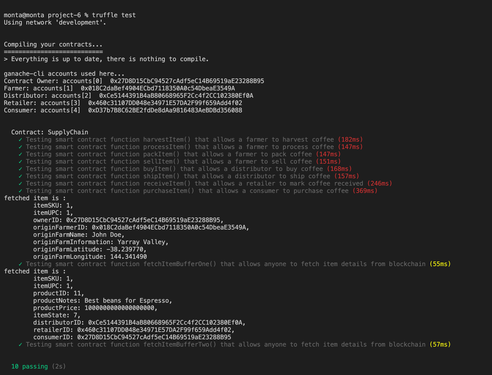

# Blockchain Developer Nanodegree  (ETHEREUM-SUPPLYCHAIN-DAPP)

This repository containts an Ethereum DApp that demonstrates a Supply Chain flow between a Seller and Buyer. The user story is similar to any commonly used supply chain process. A Seller can add items to the inventory system stored in the blockchain. A Buyer can purchase such items from the inventory system. Additionally a Seller can mark an item as Shipped, and similarly a Buyer can mark an item as Received.

## Program version numbers
`truffle version`

* Truffle v5.1.61 (core: 5.1.61)
* Solidity - 0.6.12 (solc-js)
* Node v15.5.1
* Web3.js v1.2.9

## Transaction ID and contract address
| Files | Transaction ID | Contract address |
| ------------- | ------------- | ------------- |
| Migrations | 0x6a65258034a7df15b701c7fbca5d46d2775f98c270ab1531b4281c82faad9cd0 | 0x23605143487bb96721CC8c82e4558bEf2282bC5d | 
| FarmerRole | 0x60761385267f2721de01a1c6c328631abb47d2e4dbfc1b285a3469ab81f8588b | 0x02681Bc3490f5c477eFB1BFa604f78D68C1545ed |
| DistributorRole | 0x6224b86dec6d2da8ffb7d970409a075969b660185ada58d5cb8afe25b8231a6c | 0x3dA9CA532fd0a94a7AF446a2C56d827f5eb7d005 |
| RetailerRole | 0x9a8e3becfe6b08d80e9cb02a5bbfc1024ad08e5ca17c932420d7d5b8a90341d6 | 0x2403172eCF01B53B92a1d1CA522360A6122F7e82 |
| ConsumerRole | 0x7c5d6eb86fd223a4d1a28257464068257a8e891158a693a49f0ac09691ed12f1 | 0x6328492264d034C2d6720cD4eC4F80ab50f14C29 |
| SupplyChain | 0x34abe08bc36cc1da27133cd70d80b0ea2026759664fa4f65180c636b4700941b | 0x7df1B614127Bd2650485e7B6AdAC6E03b86C43f7 |

## UML

### Activity

### Sequence

### State

### Classes (Data Model)

## Libraries
1. `truffle-hdwallet-provider` : HD Wallet-enabled Web3 provider was used to sign transactions for addresses derived from a 12
* `npm install --save truffle-hdwallet-provider`
2. `truffle-assertions` : Assertion library used  to verify the emitted events
* `npm install --save truffle-assertions`

## How to compile and test
`truffle develop`

`truffle> compile`

`truffle> migrate --reset`

`truffle> test`

#### Screenshot (tests result)

### Deploy smart contract on a public test network
`truffle migrate --reset --network rinkeby`

### Launch front-end server
In a separate terminal window, launch the DApp:
`npm install`

`npm run dev`

#### Screenshot (front-end app)

